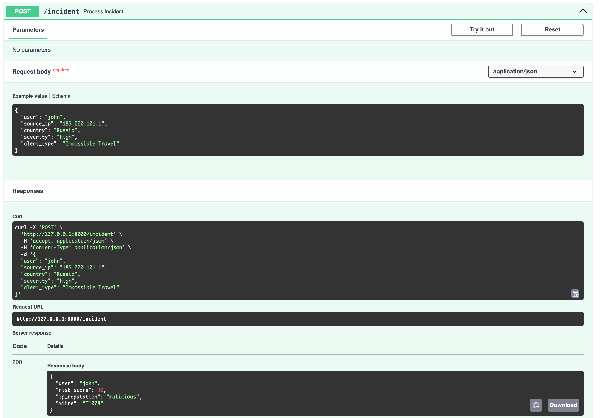

# AI Security Incident Assistant

A FastAPI-based Security Operations automation platform that performs:

- Alert Validation
- Risk Scoring
- Threat Intelligence Enrichment
- MITRE ATT&CK Mapping
- Incident Logging

## Architecture


## API Demo



## Project Structure

```text
security-ai-assistant/

├── app.py
├── models.py
├── risk_engine.py
├── threat_intel.py
├── mitre_mapper.py
├── logs/
│   └── logger.py
├── requirements.txt
└── README.md
```

## Features

### Risk Scoring

Calculates risk based on:

- Alert Severity
- Country Reputation

### Threat Intelligence

Checks IP reputation.

### MITRE ATT&CK Mapping

Maps alerts to ATT&CK techniques.

Examples:

- Impossible Travel → T1078
- Brute Force → T1110

### Logging

Records:

- Incident Processing
- Risk Score
- Threat Intelligence Results
- MITRE Technique

## API Endpoint

### POST /incident

Request

```json
{
  "user": "john",
  "source_ip": "185.220.101.1",
  "country": "Russia",
  "severity": "high",
  "alert_type": "Impossible Travel"
}
```

Response

```json
{
  "user": "john",
  "risk_score": 90,
  "ip_reputation": "malicious",
  "mitre": "T1078"
}
```

## Installation

```bash
git clone <repo-url>

cd security-ai-assistant

python3 -m venv venv

source venv/bin/activate

pip install -r requirements.txt

uvicorn app:app --reload
```

Open:

```text
http://127.0.0.1:8000/docs
```

## Future Improvements

- VirusTotal Integration
- AbuseIPDB Integration
- OpenAI Integration
- LangChain Tools
- LangGraph Workflow
- Multi-Agent SOC
- Automated Remediation
